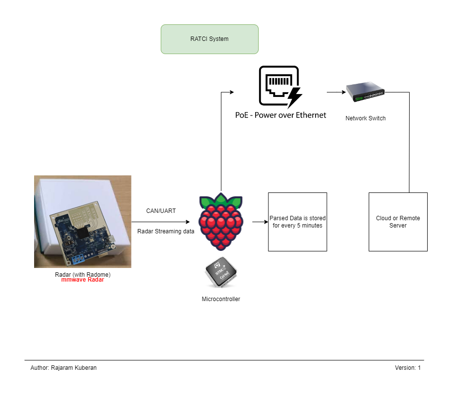

# Radar Automated Traffic Count Insight (RATCI)

The **Radar Automated Traffic Count Insight (RATCI)** is a comprehensive solution designed to automate the process of traffic counting using radar technology. It involves the deployment of radar sensors at strategic locations to capture data on vehicular movement.

## Overview

The primary purpose of the RATCI System is to provide accurate and real-time insights into traffic patterns, volumes, and trends. This information is invaluable for urban planning, transportation management, and infrastructure development.

## RATCI System

<p align="center" >
	
</p>

## Functionality

- **Radar Sensors**: The system utilizes radar sensors capable of detecting vehicles' presence, speed, and direction of travel.
- **Data Collection**: Radar sensors continuously collect traffic data, including vehicle counts, speed distributions, and occupancy rates.
- **Data Processing**: The collected data is processed and analyzed to extract meaningful insights using advanced algorithms and analytics techniques.
- **Visualization**: The insights generated by the RATCI System are presented through intuitive dashboards, reports, and visualizations, enabling stakeholders to understand traffic dynamics effectively.

## Key Features

- **Accuracy**: The system provides highly accurate traffic data, even in challenging weather and lighting conditions.
- **Real-time Monitoring**: Stakeholders can monitor traffic conditions in real-time, enabling proactive decision-making.
- **Historical Analysis**: The system maintains a historical database of traffic data, facilitating trend analysis and long-term planning.
- **Scalability**: The RATCI System is scalable and can be deployed in various environments, including highways, urban streets, and intersections.

## Benefits

- **Improved Traffic Management**: The insights provided by the RATCI System enable authorities to optimize traffic flow, reduce congestion, and enhance road safety.
- **Data-driven Decision Making**: Decision-makers can make informed decisions based on accurate and up-to-date traffic data, leading to more effective urban planning and infrastructure development.
- **Cost-effectiveness**: Automated traffic counting reduces the need for manual data collection efforts, resulting in cost savings for transportation agencies and municipalities.

The Radar Automated Traffic Count Insight (RATCI) System represents a sophisticated solution for automating traffic counting and gaining actionable insights into traffic behavior, ultimately contributing to safer, more efficient, and sustainable transportation systems.


#  RATCI System Implementation


<!--
## Paper Information
- Title:  `paper name`
- Authors:  `A`,`B`,`C`
- Preprint: [https://arxiv.org/abs/xx]()
- Full-preprint: [paper position]()
- Video: [video position]()
-->

## Install & Dependence
- python
- xgboost
- lightgbm
- pandas
- numpy
<!--
## Dataset Preparation
| Dataset | Download |
| ---     | ---   |
| dataset-A | [download]() |
| dataset-B | [download]() |
| dataset-C | [download]() |
-->

## Directory Hierarchy
```
|—— assets
|    |—— ratci-system.png
|—— cfg
|    |—— profiles_50.cfg
|    |—— profiles_50_1.cfg
|    |—— profiles_50_10.cfg
|    |—— profiles_50_15.cfg
|    |—— profiles_50_20.cfg
|    |—— profiles_50_5.cfg
|—— datasheet
|    |—— IWR6843ISK.pdf
|—— parsed_data
|    |—— sample
|        |—— data_20240224-231830.csv
|        |—— data_20240224-232330.csv
|—— radar_parsing
|    |—— mmwave_parse.py
|—— radar_processing
|    |—— bike_lane_model.py
|    |—— centre_lane_model.py
|    |—— dataframe_creation.py
|    |—— Fast_Lane_Final_Model.pkl
|    |—— fast_lane_model.py
|    |—— features_bike_lane.py
|    |—— features_centre_lane.py
|    |—— features_fast_lane.py
|    |—— features_slow_lane.py
|    |—— main.py
|    |—— Slow_Lane_Final_Model.pkl
|    |—— slow_lane_model.py
|—— README_1.md
```

## Use
- for traffic_count output (RATCI System)
  ```
  python main.py
  ```
- for parsing
  ```
  python mmwave_parse.py
  ```
<!--
## Pretrained model
| Model | Download |
| ---     | ---   |
| Model-1 | [download]() |
| Model-2 | [download]() |
| Model-3 | [download]() |
-->


## Code Details
### Tested Platform
- software
  ```
  Raspberry Pi OS (formerly Raspbian), Ubuntu LTS
  Python: 3.8.5  
  ```
- hardware
  ```
  Single-board computer/Microcontroller: Raspberry Pi 4(2GB)
  Radar: mmWave Radar(TI IWR6843)
  ```
<!--
### Hyper parameters
```
```
-->
## References
- [RaspberryPi4](https://www.raspberrypi.com/products/raspberry-pi-4-model-b/)
- [mmWave Radar](https://www.ti.com/product/IWR6843)
  
## Citing
If you find the RATCI System useful and wish to reference it in your work, please use the following citation:
```
@misc{kuberan_2023,
author = {Rajaram Kuberan},
title = {Radar Automated Traffic Count Insight (RATCI) System},
year = {2023},
Citation = {Cite this github link}
}
```
