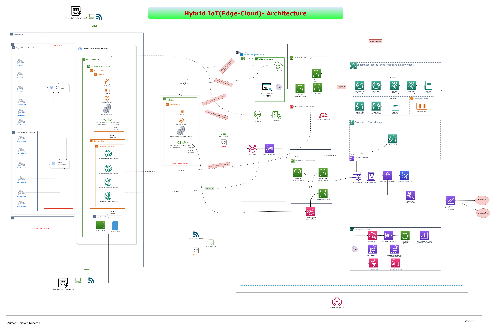

## Production Grade E2E Scalable IoT Architecture Pipeline - NVIDIA + AWS

    
     
    <em>Figure: E2E Architecture <strong>(Zoom In)</strong></em>

## Prerequisites

### Hardware Requirements

| Device                       | Model Type                                                                                        |
| ---------------------------- | ------------------------------------------------------------------------------------------------- |
| Edge Device- Jetson Module   | [XavierNX/Orin](https://www.nvidia.com/en-gb/autonomous-machines/embedded-systems/jetson-orin/)   |
| Edge Device- Microcontroller | [STM32](https://www.st.com/en/microcontrollers-microprocessors/stm32-32-bit-arm-cortex-mcus.html) |
| Surveilliance Cameras        | [IR Cameras](https://www.e-consystems.com/gige-cameras/sony-starvis-imx662-2mp-ip67-camera.asp)   |

### Software Requirements 

#### [Nvidia SDK Manager](https://developer.nvidia.com/sdk-manager)
#### AWS Cloud Subscription

