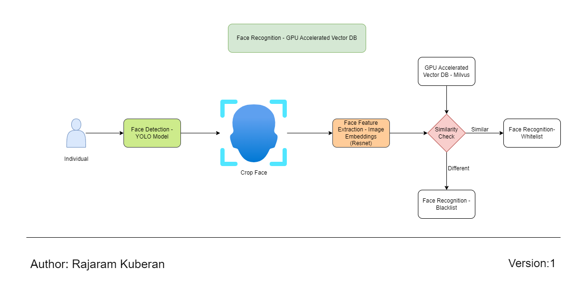

## Face Recognition GPU Accelerated System

<p align="center" >
	
</p>

## Install & Dependence
- python
- pytorch
- numpy
- Zilliz - Milvus Vector DB

## Directory Hierarchy
```
|—— .env
|—— assets
|    |—— img
|        |—— apj.jpg
|    |—— ref_diag
|        |—— face.png
|—— face_embeddings.py
|—— face_rec.py
|—— milvus-standalone-docker-compose-gpu.yml
|—— milvus-standalone-docker-compose.yml
|—— requirements.txt
|—— starter.sh
```
### Hardware Requirements

| Device                       | Model Type                                                                                        |
| ---------------------------- | ------------------------------------------------------------------------------------------------- |
| Edge Device- Jetson Module   | [XavierNX/Orin](https://www.nvidia.com/en-gb/autonomous-machines/embedded-systems/jetson-orin/)   |
| Surveilliance Cameras        | [IR Cameras](https://www.e-consystems.com/gige-cameras/sony-starvis-imx662-2mp-ip67-camera.asp)   |